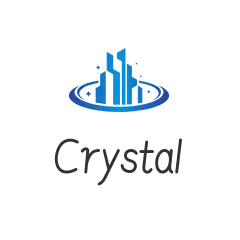
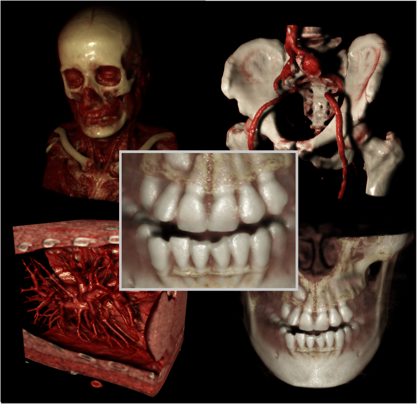
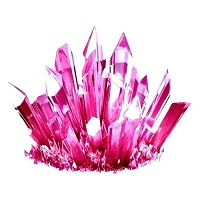

# 

> Crystal - A `modern`, `fashionable`, `high-quality` 3D visualization tool for medical images

---
#  Build this project

## Dependent third-party libraries

> 
>
> **Qt** version 6.2   
> https://www.qt.io/product/qt6

> 
>
> **Nvidia Cuda** version 11.0   
> https://developer.nvidia.com/cuda-toolkit

> 
>
> **VTK** version greater than 7.0   
> https://vtk.org/

## Corresponding CMake path that needs to be modified (in CMakeLists.txt)

> **Qt Dir**
> - set(Qt6_DIR "D:/DevTools/Qt6/6.2.4/msvc2019_64/" CACHE PATH "qt5 cmake dir") 

> **VTK Dir**
> - set(VTK_DIR "D:/DevTools/VTK8-Install") \
> - set(VTK_Debug_Lib_DIR ${VTK_DIR}/lib-Debug) \
> - set(VTK_Debug_Dll_DIR ${VTK_DIR}/bin-Debug) \
> - set(VTK_Release_Lib_DIR ${VTK_DIR}/lib-Release) \
> - set(VTK_Release_Dll_DIR ${VTK_DIR}/bin-Release) \
> - set(VTK_Include_DIR ${VTK_DIR}/include) 

---
#  Supported Features

## 3D medical images Cinematic rendering

> Utilize advanced visualization techniques to process medical image data, and apply physically-based rendering techniques to achieve realistic rendering effects.

## Advanced Visualization Tools

> Implement multiple visualization processing algorithms and enable interactive operation of said algorithms.

## Support for multiple light sources

> Provide support for multiple light sources, including point light, surface light, directional light, and high dynamic range environment mapping, to illuminate medical 3D data.

## Real time denoising

> Provide real-time denoising capabilities for realistic rendering, with the intention of achieving high-quality rendering results in interaction.

